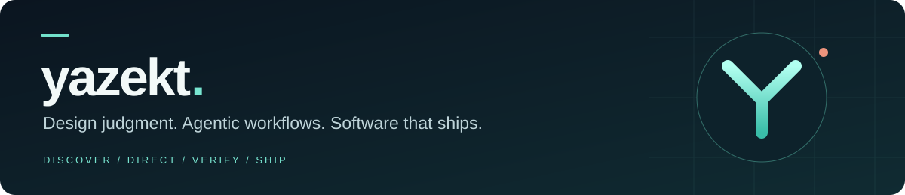
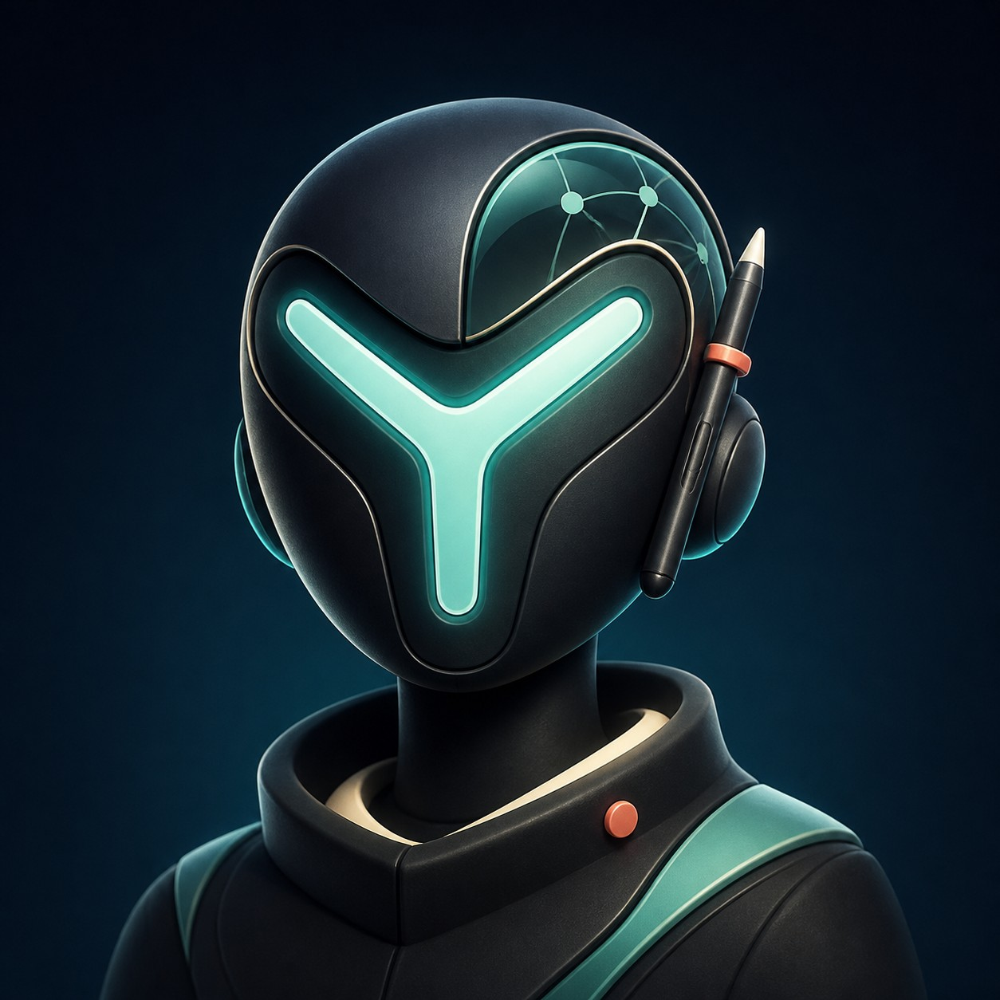

  

# Hi, I'm Kirsten Trimaley

**Graphic designer exploring agentic development.**  
Known online as **yazekt** · East London, Eastern Cape, South Africa

I'm a graphic designer with 10 years of experience, now learning to build Windows and web apps with AI. I bring a designer's eye for clarity, usability, and detail to the practical problems I want to solve.

Seeing how quickly AI is changing creative work made me think seriously about my future. That concern grew into curiosity, and curiosity became a reason to start building. I want to work with AI, understand its capabilities and limits, and turn what I learn into useful software.

## What I'm building towards

- **Windows apps** that make everyday work simpler and keep local workflows easy to manage.
- **Web apps and business tools** that reduce repetitive tasks and make information easier to use.
- **Thoughtful interfaces** where clear design supports reliable, useful functionality.

I'm early in my coding journey. I use AI agents to help plan, implement, debug, and improve projects, while learning how the pieces fit together and checking that the result works.

## Learning through real projects

These are tools and technologies I've been working with through AI-assisted projects. I'm still developing my understanding of them.

| Area | What I'm working with |
| --- | --- |
| AI-assisted development | Codex, ChatGPT |
| Desktop and interfaces | Electron, React, TypeScript |
| Local data | SQLite |
| Automation and exploration | Python, Go, Playwright |
| Version control | Git, GitHub |

My next goal is to get better at choosing a technology stack for a specific problem: understanding the user's needs, planning the interface and data, connecting the parts, testing behaviour, and delivering an app people can use.

## How I want to build

**Understand the problem → plan a small step → build with AI → test it → improve it.**

I care about readable interfaces, safe data handling, honest progress, and software that works in everyday use. I'm learning to ask better questions, evaluate AI-generated code, and understand the decisions behind each project.

## Let's connect

I'm open to **freelance work, employment opportunities, and collaboration**, especially where design, practical software, and AI-assisted development meet. I'm also continuing to learn through personal projects.

**Email:** [kirstentrimaley@gmail.com](mailto:kirstentrimaley@gmail.com)

---

10 years in design. A new chapter in code. Learning by building.
